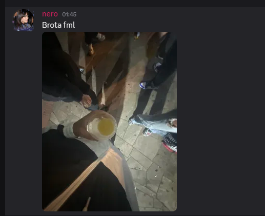

# Hello World!, I'm John, a Brazillian Java & C++ starter 👋🏼:
🍕 Currently working on my friends server [Redecrow](https://discord.gg/redecrow) 👨🏼‍🎓 And working on another friend project [Ghost-Injection](https://discord.gg/ZtAFmFynsP)  👨🏼‍💻 Developer since december 2024  🎬 Starting a new project <i>Bypass for Ocean/Screenshare</i>

# 💻 Tech Stack:

